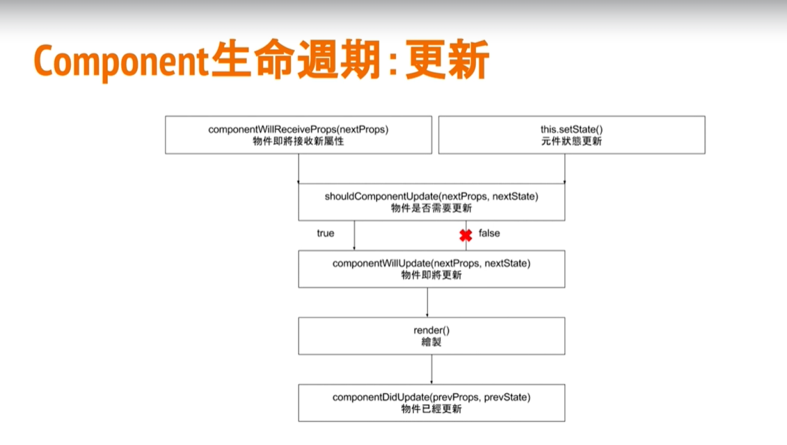

# React說明
- cdd開發流程( Component Driven Development )
- react代替開發者操作DOM Tree避免不必要的操作
- 以元件最後樣貌作為結果,再以結果和虛擬DOM比較後做出最佳化操作

# jsx語法
- react使用jsx語法
- JSX 使用html語法描述畫面並具備JS特性

# React生命週期
## :掛載順序
```
constructor()建構式 
        v
componentWillMount()物件即將載入 
        v
render()繪製 
        v
componentDidMount物件已經載入
```
## :Component生命週期:更新



# React屬性與狀態
- 屬性:由上層元件以JSX屬性傳入，可想像成HTML的屬性(attribute),不可修改
- 狀態:由元件自身擁有，在建構式中宣告，存放自身的狀態，可以任意修改
```html
<!-- src，className，alt為屬性 -->

```
### 可將資料狀態存入建構式中的this.state
```js
class App extends React.Component {
  constructor(){
    super();
    this.state = {
        count: 0
    }
  }
}
```
並在要呼叫的地方使用this.setState
```js
addClickCount(){
    this.setState({
        count: this.state.count ++
    })
}
```
# PureComponent
- PureComponent和Component基本上完全相同，但其在props和state改變時會先進行淺層比較，判斷是否需要重新render

# React中的List和key
- 在React中使用index當作key會造成React判斷錯誤，render會重新渲染(效能不好)
```jsx
return(
  <ol>
    {this.state.list.map((item, index) => {
      return (
        <Li
          // 正確方法須使用item.id
          key={index}
          // 正確方法須使用item.id
          keyText={index}
          text={item.text}
        />
      )
    })
    }
  </ol>
)
```

# React To Do 實作
- 資料必須放在所有會用到該物件的上層或更上層
  - 將假資料放在所有元件最上層的app中
<p>在最外層app元件中新增一筆假資料,並傳入Title元件中讓其顯示對應的筆數</p>
 
<p>在要取參數的元件中傳入</p>

```js
// App.js
class App extends Component {
  constructor(){
    super();
    // let todos = ['learn React','write YT']
    this.state = {
      // 將資料放入state
      todos:  ['learn React','write YT']
    }
  }
  render(){
    return (
      <div>
        {/* 將存放在state中的資料傳遞至Title元件 */}
        <Title todos={this.state.todos}/>
      </div>
    );
  }
}
//Title.js
class Title extends Component {
    render(){
        return(
            // 取得App所傳入參數
            <h2>代辦清單項目({this.props.todos.length})</h2>  
        )
    }
}
```
1. 在外層App中傳入組件參數(props)到TodoList(要顯示代辦清單的原件)中
2. 在TodoList元件中,將傳入參數透過map渲染

```js
//App.js
class App extends Component {
  constructor(){
    super();
    // let todos = ['learn React','write YT']
    this.state = {
      todos:  ['learn React','write YT']
    }
  }
  render(){
    return (
      <div>
        {/* 將存放在state中的資料傳遞至TodoList元件 */}
        <TodoList todos={this.state.todos}/>
      </div>
    );
  }
}
```
```js
//TodoList.js
class TodoList extends Component {
    render(){
        // ES6解構賦值
        const { todos } = this.props
        return(
            <div>
                {/* 利用map將傳入參數個別return */}
                { todos.map((item, index) => {
                   return <h3 key={index}>{item}</h3> 
                }) }
            </div>
        )
    }
}
```

## 新增代辦事項按鈕:資料異動
- 按下按鈕時,呼叫函式新增
- 該函式取得輸入框中的值
- 異動(更新)代辦資料
<p>react操作input:不再取得輸入框值,而是給予輸入框值</p>
1. 在app.js新增一個createTodo函式,更新新增的代辦,並設定傳入CreateTodo元件

```js
// App.js新增一個
import React, { Component } from 'react';
import Title from './components/title'
import CreateTodo from './components/CreateTodo';
import TodoList from './components/TodoList'

class App extends Component {
  constructor(){
    super();
    // let todos = ['learn React','write YT']
    this.state = {
      todos:  ['learn React','write YT']
    }
  }

  //加入新增的陣列
  createTodo(newtodo){
    console.log('App.newtodo',newtodo)
    this.setState({
      todos: [newtodo,...this.state.todos]
    })
  }
  render(){
    // 以組件傳遞的方式傳入CreateTodo組件
    return (
      <div>
        <CreateTodo
          createTodo={(newtodo) => this.createTodo(newtodo)}/>
      </div>
    );
  }
}
export default App;
```
2. 在CreateTodo元件中,新增一個state存放輸入框資料
3. 在抓取輸入框資料updateInpute,透過參數event.target.value抓取

```js
// CreateTodo.js
class CreateTodo extends Component {
  constructor() {
    super()
    this.state = {
        inputText: ''
    }
  }
  // 更新輸入框方法
  updateInpute(event) {
    this.setState({
        inputText: event.target.value
    })
  }
  createTodo() {
    // 傳遞輸入框的值
    // &&條件式true時回傳右邊
    this.state.inputText &&
    this.props.createTodo(this.state.inputText)
    // 新增完後刪除輸入框內文字
    this.setState({
        inputText: ''
    })
  }
  render() {
    return (
      <div>
          <input onChange={(event) => this.updateInpute(event)}/>
          <button onClick={()=> this.createTodo()}> 新增 </button>
      </div>
    )
  }
}

export default CreateTodo
```

## 移除代辦功能

1. 在最外層組件新增一個remo新增一個removeTodo事件,並傳遞至子元件(TodoList)

```js
// App.js
removeTodo(id){
  // 使用setState更新todos達到刪除效果
  this.setState({
    todos: this.state.todos.filter((item,index) =>{
      return index !== id
    })
  })
}
render(){
  return (
    <div>
      <TodoList todos={this.state.todos} 
      removeTodo={(id) => {this.removeTodo(id)}}/>
    </div>
  );
}
```
1. 子元件透過onClick判斷,id一樣的將會刪除
```js
{
  todos.map((item, index) => {
    return (
      <li key={index}
      // 傳遞index到App.js removeTodo事件
        onClick={ () => this.props.removeTodo(index) }
      >
          {item}
      </li>
    )
  })
}
```

## 使用styled-components撰寫react css樣式
- 使用畫面元件最為開發基礎(元件本身代表畫面)
1. 安裝至node_modules
```
npm install --save styled-components
或
yarn add global styled-components
```
2. 並在虛使用的地方import
```js
import styled from 'styled-components'
```
3. 宣告一個變數(字首需大寫),指定其標籤並給予樣式
```js
import styled from 'styled-components'
// 給予div ,background顏色
const DivBg = styled.div`
  background: #666;
`
render(){
  return (
    <DivBg>
      <span></span>
    </DivBg>
  );
}
```
4. 因為使用樣板字面值所以這個方法可以透過js動透修改css
```js
// 判斷傳入組件參數,有傳入參數時回傳('red'),沒有時回傳'green'
const DivBg = styled.div`
  background:  ${(props) => {return props.color || 'green' }};
`
render(){
  return (
    // 傳遞組件參數'red'
    <DivBg color="red">
      <span></span>
    </DivBg>
  );
}
```
5. 使用keyframes達到css動畫效果
```js
// 先宣告一個動畫效果,fadein
const fadein = keyframes`
  from{
      margin-left: 100%
  }
  to{
      margin-left: 0%
  }
`
// 並將其帶入要顯示的標籤,li
const Li = styled.li`
    animation: 2s ${fadein};
`
// 渲染即可達成
render(){
  return (
    <Li>
      <span>1</span>
    </Li>
  );
}
```
## 利用styled達到RWD效果

```JS
// 設定768px時顯示顏色origin
const DivBg = styled.div`
  background: green;
  @media (max-width:768px) {
    background: orange;
  }
`
```
## React Router
- 安裝React Router
```
npm install react-router-dom --sace
```
```js
import { BrowerRouter, Route ,Link } from 'react-router-dom'
```
### React Router三大核心
  - BrowerRouter
    - React Router在瀏覽器環境下的核心
    - 透過 BrowerRouter 監控 React Router 網址異動
  - Route
    - 符合網址德對應,應用程式(元件)及顯示
    - path為對應路徑
      - 加上exact為路徑完全符合時才渲染畫面 
```js
<BrowserRouter>
  <div>
    <Route exact path="/home" render={ () => <div>Home</div> }/>
    <Route exact path="/user" render={ () => <div>User</div> }/>
  </div>
</BrowserRouter>
```
  - Link
    - 類似a連結,給予 to="/對應網址"
```html
<ul>
  <li><Link to="/home"/>Home</li>
  <li><Link to="/user"/>User</li>
</ul>
```
### BrowerRouter


## 6. 加入分類頁SPA
<p>更新代辦物件內容</p>
 


## Redux
- Action  (透過actiont觸發reducer)
- Reducer (觸發後更新store資料)
- Store (儲存所有資料狀態)
### 安裝redux
```
npm install redux 
npm install react-redux
  或yarn命令
yarn add redux
yarn add react-redux
```
1. 定義reducer(操作事件更新store)
- 新增一個reducers資料夾 > index.js

```js
// 要管理的資料
const initState = {
    todos: [
        { text: '學React', groupid: 'work' },
        { text: '撰寫企劃', groupid: 'life' },
        { text: '每周健身', groupid: 'life' },
        { text: '找朋友', groupid: 'life' },
        { text: '學英文', groupid: 'work' },
    ]
}
// Rucder
// 給予state預設值,為要管理的資料
const todoReducer = (state = initState, action) => {
  // 還沒定義action所以先回傳預設值
  return state
}

export default todoReducer
```
2. 定義action(定義要操作事件)
- 新增一個actions資料夾 > index.js
- 將要操作的'事件'放在裏頭
```js
// 透過function觸發action,輸出後(export)可以在每個component中使用
export const createTodo = (text) => {
    return {
        // type讓reducer分變該做什麼時使用,以大寫定義
        type: 'CREATE_TODO',
        // paylod為action提供給Reducer的參數
        paylod:{
          text: text,  
        },
    }
}

export const removeTodo = (id) =>{
    return {
        type: 'REMOVE_TODO',
        // id: id變數名稱和屬性名稱相同時可直接省略寫法
        id
    }
}
```
3. 定義完action後,更新reducer
```js
const todoReducer = (state = initState, action) => {
  switch (action.type) {
    case 'CREATE_TODO':
    // 物件傳參考特性,將原本state複製到空物件中再行操作
      return Object.assign({}, state, {
        todos: [...state,{text: action.text}]
      })
    case 'REMOVE_TODO':
      return Object.assign({}, state, {
        todos: state.todos.filter(todo => {
          return (
            todo.id !== action.id
          )
        })
      })
    default:
      // 條件都不符合時,回傳最原本的state
      return state
  }
}
```
4. 定義store
- 在app.js引入要定義store的檔案
```js
// 引入redux store
import { createStore } from 'redux'
import todoReducer from './reducers/index'

// 將引入的reducers帶入store
let store = createStore(todoReducer)
```
5. Provider
- 透過Provider將store資料傳遞到所有子組件中
```js
import { Provider } from 'react-redux'


class App extends Component{
  render(){
    return(
      // 將剛剛宣告的組件傳遞下去 store={剛剛宣告的store}
      <Provider store={store}>
        ...
      </Provider>
    )
  }
}
```
6. connect
- 透過connect在子組建中,返回與store連結的組件
- connect參數
  - mapStateToProps (定義reducer,state資料)
    - 將store中,state資料轉換為該元件的組件 
  - mapDispatchToProps((定義reducer,事件)
  
```js
// 子組件<TodoList />

// redux,connect返回與store互相連結的組件
import { connect } from 'react-redux'

class TodoList extends Component {
  ...
}

const mapStateToProps = (state) =>{
    return{
      state
    }
}

// 在輸出時調用connect
export default connect(mapStateToProps,)(TodoList)
```

## React引入組件:props.children
- 可以使用props.children將元件引入
<p>像是要將容器外層統一用一個元件管理css(padding),就可以使用</p>

```js
// 父元件
const PaddingContainer: React.FC = (props) => {
    const classes = useStyles()
    return (
        // props.children為要引入的子元件
        <div className={classes.paddingContainer}>
            {props.children}
        </div>
    )
}
```
<p>引入後(imp)就可以將包在裡面的子元件傳遞到父元件中</p>

```js
// 子元件

import PaddingContainer from '../components/index'

return (
  <PaddingContainer>
    <Grid>
      test
    </Grid>
  </PaddingContainer>
)
```